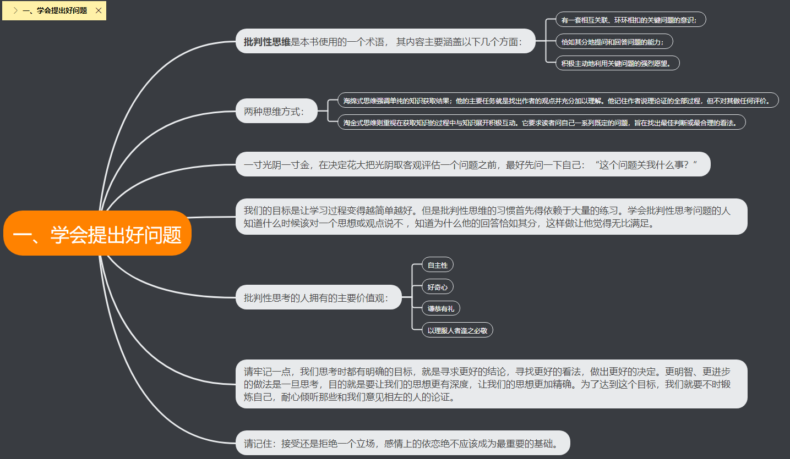
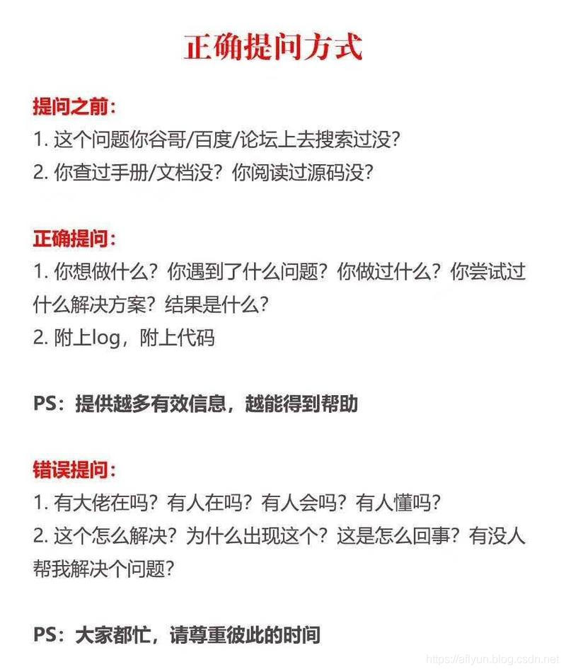

#  ASK
> 这里会收集一些提问方式和技巧的查克拉，取其精华。

## 提问的智慧
> 我们不想掩饰对这样一些人的蔑视--他们不愿思考，或者在发问前不去完成他们应该做的事。这种人只会谋杀时间--他们只愿索取，从不付出，无端消耗我们的时间，而我们本可以把时间用在更有趣的问题或者更值得回答的人身上。 我们称这样的人为“失败者”（由于历史原因，我们有时把它拼作“lusers”）。

[提问的智慧](https://www.dianbo.org/9238/stone/tiwendezhihui.htm)

推荐阅读Github：[《How To Ask Questions The Smart Way》](https://github.com/ryanhanwu/How-To-Ask-Questions-The-Smart-Way/blob/master/README-zh_CN.md)

---

### 提出好问题

推荐阅读 一本书 ：[《学会提问》](https://book.douban.com/subject/1504957)

---

### 提问前做这4件事
当我们碰到问题，不要着急找人提问，先自己尝试下面 4 步 ——

- 1 阅读产品说明书
- 2 搜索
- 3 试错
- 4 朋友圈求助

如果都不行，再找别人提问。提问前做 4 件事 ——

- 1 别问在吗，先发红包
- 2 把问题描述清楚
- 3 准备工作做好
- 4 平时多交流，混脸熟

[我研究了 100 位赚钱高手，他们在提问前都会做这4件事](https://mp.weixin.qq.com/s/Y6ip_MrvghdXLLHWpttUmQ)

## 总结-共勉

### 更好的提问
向别人请教问题，要说明：

- 问题的背景
- 你的能力
- 你遇到啥问题？做了什么尝试？
- 你有什么猜想？

如果一个问题，你不能用一句话描述清楚，那说明你没有自己的思考，这种情况下，不适合问别人，而是去问百度/谷歌。

[共勉：作为一名程序员你应该怎么提一个高质量的问题？](https://aflyun.blog.csdn.net/article/details/91128171)

### 更好的回答

**态度和善一点**。问题带来的压力常使人显得无礼或愚蠢，其实并不是这样。

**对初犯者私下回复**。对那些坦诚犯错之人没有必要当众羞辱，一个真正的新手也许连怎么搜索或在哪找常见问题都不知道。

**如果你不确定，一定要说出来**！一个听起来权威的错误回复比没有还要糟，别因为听起来像个专家很好玩，就给别人乱指路。要谦虚和诚实，给提问者与同行都树个好榜样。

**如果帮不了忙，也别妨碍他**。不要在实际步骤上开玩笑，那样也许会毁了使用者的设置 —— 有些可怜的呆瓜会把它当成真的指令。

**试探性的反问以引出更多的细节**。如果你做得好，提问者可以学到点东西 —— 你也可以。试试将蠢问题转变成好问题，别忘了我们都曾是新手。

尽管对那些懒虫抱怨一声 RTFM 是正当的，能指出文件的位置（即使只是建议个 Google 搜索关键词）会更好。

**如果你决定回答，就请给出好的答案**。当别人正在用错误的工具或方法时别建议笨拙的权宜之计（workaround），应推荐更好的工具，重新界定问题。

**正面的回答问题**！如果这个提问者已经很深入的研究而且也表明已经试过 X 、 Y 、 Z 、 A 、 B 、 C 但没得到结果，回答 试试看 A 或是 B 或者 试试 X 、 Y 、 Z 、 A 、 B 、 C 并附上一个链接一点用都没有。

帮**助你的社区从问题中学习**。当回复一个好问题时，问问自己如何修改相关文件或常见问题文件以免再次解答同样的问题？，接着再向文件维护者发一份补丁。

如果你是在研究一番后才做出的回答，**展现你的技巧而不是直接端出结果。【毕竟授人以鱼不如授人以渔】**。

---

<b><em>骐骥一跃，不能十步；驽马十驾，功在不舍；锲而舍之，朽木不折；锲而不舍，金石可镂。——《荀子·劝学》</em></b>