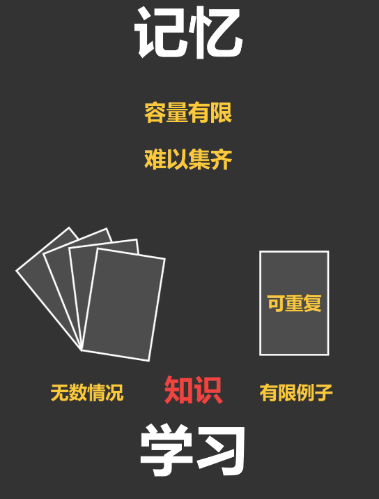

#  Study
> 这里会收集一些学习相关的查克拉，取其精华。

## 学习/记忆
> 学习是从有限的例子中，找出问题和答案之间规律的一个过程，而所找出的规律叫做知识.

[学习观01：好多人一辈子都没搞清什么是学习](https://zhuanlan.zhihu.com/p/46841114)

## 知识/技能/能力
> 知识是人脑对客观事物的主观表征；技能是指人们通过练习而获得的动作方式和动作系统；能力则是学习者对学到的知识和技能经过内化的产物，是使活动顺利完成的个性心理特征。

[能力与知识、技能三者之间的区别与联系是什么](https://www.zhihu.com/question/22475646/answer/167381293)

## 高效学习
> 坚持才是最重要的，否则在牛逼的技巧也毫无卵用

[【学习力】如何提高学习效率综合贴-思维导图](https://www.processon.com/view/link/60163c5af346fb7423bfa913)

# Skill

## 费曼学习法
> 如果你不能用自己的话通俗易懂地把一个新知识点讲出来，说明你没有真正理解它。

- [高效学习方法——费曼技巧学习法！](https://mp.weixin.qq.com/s/o7xy-aAtjAvpcfHmtGbewA)

## 新技术学习路线

> 面对一项新技术的时候，我们怎样去学习才能循序渐进，最终理解得深刻？

让我们先把可供自学的资料列出来，分析一下：
- Tutorial（入门教程）。由该项技术的官网提供。通常是英文的。这份资料是给初次接触该项技术的人看的，一般是一步一步地教你完成某些例子。当我们说某项技术对于新手不太友好的时候，一般也是因为这项技术的Tutorial部分做得不够好。
- Specification，简称Spec。这是集中体现该项技术的设计思想的东西，是高度抽象的描述。这个一般也是一份完备的、系统的描述，包含该项技术涉及到的方方面面。这部分资料在不同的地方叫法不同，在相对简单的技术项目中，也可能没有；在另一些情况下，这部分资料混杂在其它文档资料之中；它还可能以论文（paper）的形式出现。
- API Reference。大而全的API索引和文档，针对不同的语言接口可能提供多份。当我们使用这项技术进行编程的时候，API - Reference自然是个离不开的、总是要不停去查询的一份资料。
- 别人写的技术博客。质量良莠不齐，到底有没有价值，我们要学会去分辨。
- 技术书籍。跟技术博客类似，质量有好有坏。稍后我们和技术博客放在一起来分析。
- Source Code。如果我们要学习的技术是开源的，那么很幸运，我们能得到源代码。这是一份终极资料。

## 其他
- [有哪些相见恨晚的高效学习方法？](https://zhuanlan.zhihu.com/p/25415549)

- [【学习力】硬核烧脑学习指南，帮你把学习效率提升 10 倍](https://mp.weixin.qq.com/s/5xq409xyABbSNrZkjvrN5g)

- [【学习力】有效管理自己知识，多总结和分享](http://note.youdao.com/noteshare?id=6c7b69a2cf3fc821578fd470db494d3e&sub=5198FCBDEF854605867785B809AC5F05)

---

<b><em> 青，取之于蓝，而青于蓝；冰，水为之，而寒于水。 ——《荀子·劝学》</em></b>
