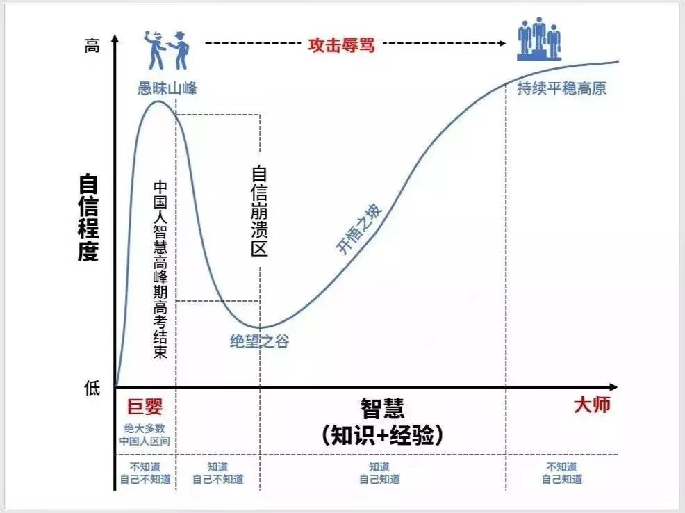
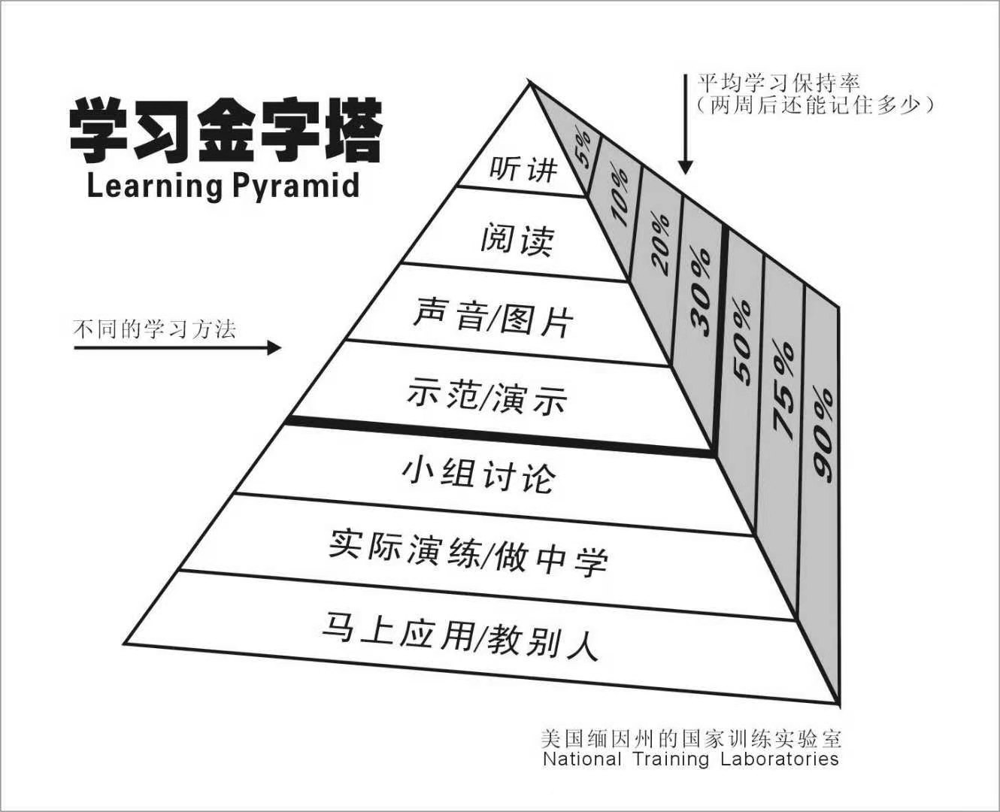
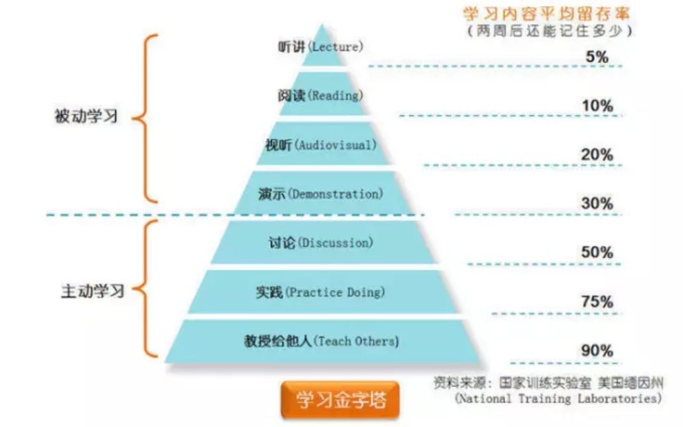

#  Think
> 这里会收集一些思维方式和技巧的查克拉，取其精华。

## 思考方式

### 黄金圈法则

> why 是最重要的，向内看，才能发现什么是最重要的

作家西蒙·西涅克在他著名的 TED 演讲《那些杰出的领袖怎么激励我们行动》中提到的「黄金圈法则」，给了我不少启发。

什么是「黄金圈法则」？

上图就是一个黄金圈模型。最里面的圈是「为什么做」，中间圈是「怎么做」，最外面一圈是「做什么」。

世界上绝大部分的人知道自己在做什么，一些人知道应该怎么做，只有少数人才意识到自己为何而做。

西蒙·西涅克观察到，那些杰出的领袖的思考、行为和交流方式都是完全一致的。他们做事的方式是由内而外，即 「为什么做」——>「怎么做」——>「做什么」。

**大多数人则是对「做什么」非常清楚，对最内核的「为什么做」却非常模糊**。

油管原链接： 

https://www.youtube.com/watch?v=qp0HIF3SfI4

### 技术思维

> 学习的终极目标是什么？技术性学习思维又有什么不同？本文从结构化思维说起，分享学习如何学习的方法。

孤尽老师分享了学习四部曲，即【记忆、理解、表达、融合】。
记忆是信息获取的第一步，就像CPU运算时，要先把数据读取到内存一般，有记忆的数据才能被大脑加工处理。如何高效的记忆呢？事实上，记忆的第一性原理还是重复，但在实际工作学习中，有一些方法能够帮助大脑更容易记住信息。
记忆分为长波记忆和短波记忆：

长波记忆：已经持久化到大脑中，忘记的时候只是因为没有检索到，但是很容易回想起来，类似磁盘存储。

短波记忆：记住一段时间就忘记了，后面怎么也想不起来，类似内存存储。

快速记忆之后的内容是还没有消化的内容，很容易忘记，需要重复的理解，将知识内化成自己的认知的一部分，并且要去表达，传递出去，让内化的知识能够使能，边学边实践才能融会贯通。

孤尽老师以记忆这一要素为启发点，**告诉我们要【培养快速学习的能力】，讲究方法和努力，并且要学会如何学习**。值得分享的是，很多时候我们是不知道自己不知道，没有仔细去思考过如何学习本身这个命题，往往一头扎进自己的业务和工作中，不可自拔，没有跳出来看看一些根本的要素。

-[你真的会学习吗？从结构化思维说起](https://mp.weixin.qq.com/s/4gKQMqZtetDIfjw5fZv_aw) 

---

> 古人说，立德立言立功为三不朽，立言就是思考力和认知力，人和人的差异，在长久的职场中或者生活中，除去运气外，其实就是认知和思考力的差异。

[技术人如何加速成长？提升你的思维和学习方式](https://mp.weixin.qq.com/s/EMZrnDRGCoIAloSFr1js5w)

## 结构思维/金字塔原理

> 教是最好的学习，实现90%的知识转化，分享是最好的方式。

[思考结构，决定一个人能看多远](https://mp.weixin.qq.com/s/xjpGjX8JGTja_oR1JTHWNA)

## 知识体系
[如何有效构建你的知识体系？｜笔记达人说](https://mp.weixin.qq.com/s/AtO_Zm7W_zpHAvmRn4wkKw)

[思维导图 | 如何建立自己的知识体系](https://mp.weixin.qq.com/s/8rupWARUBLfxRuI2p83ssg)

# Idea

